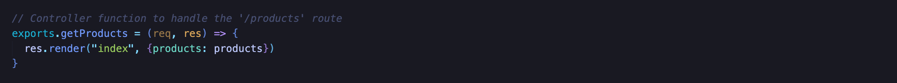
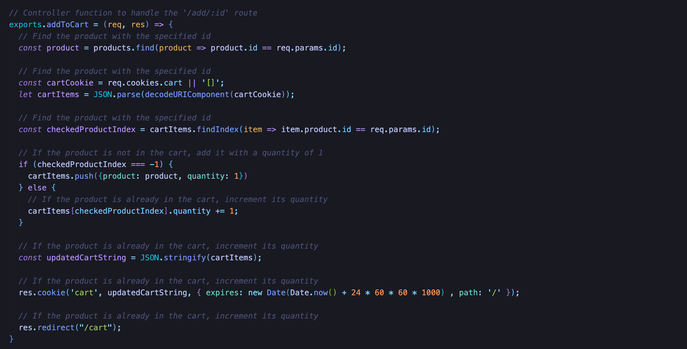
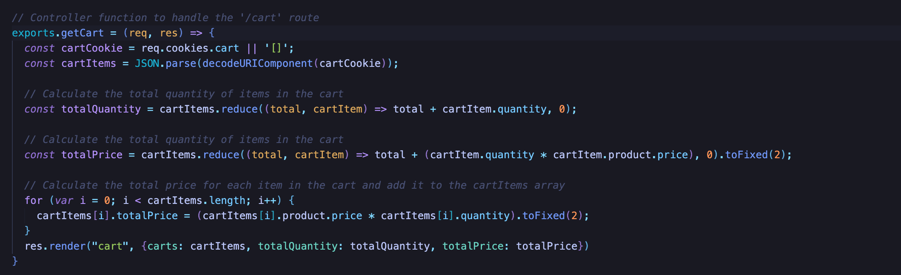
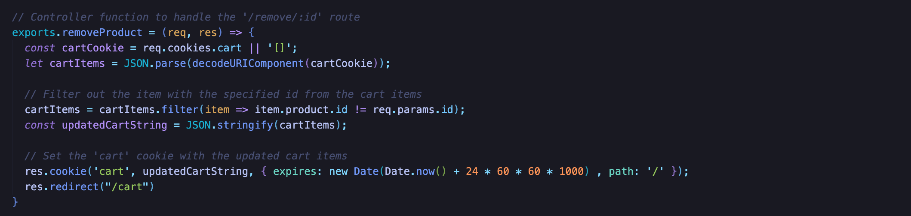
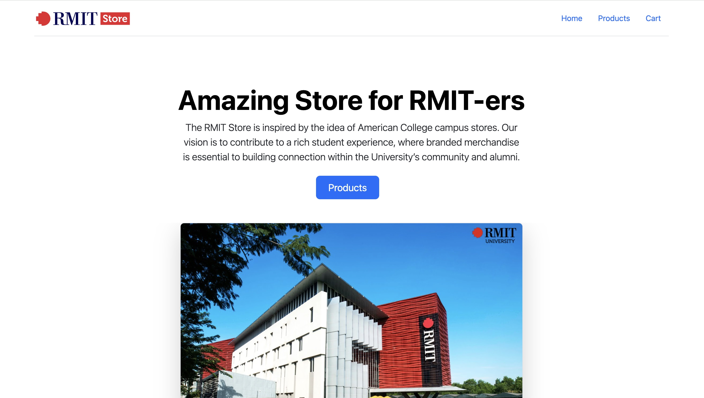
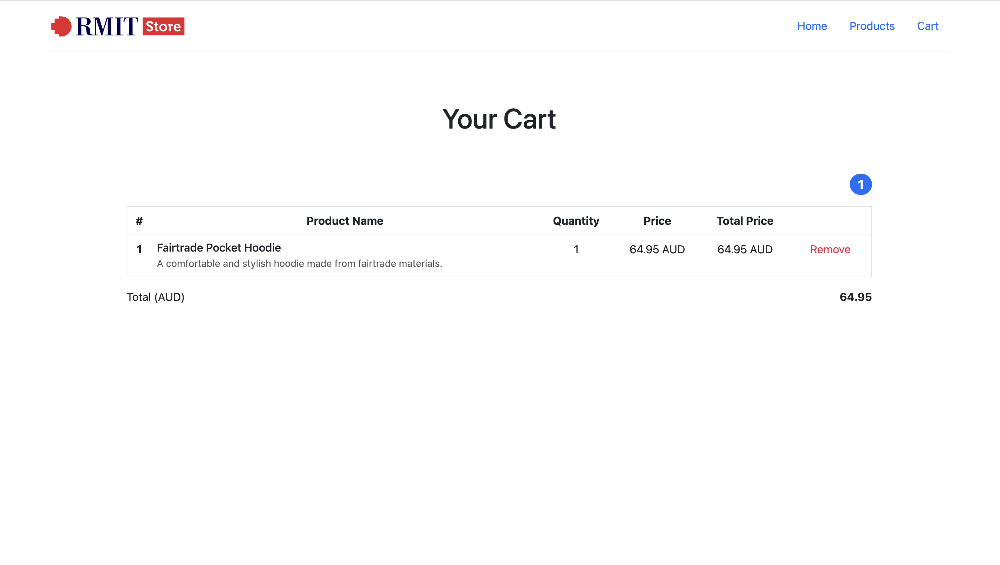
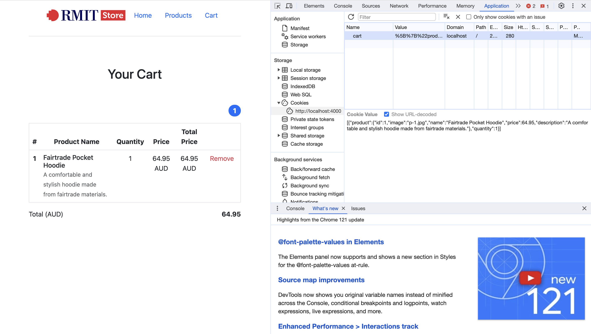

# cookie-express-demo-for-adding-to-cart

## 1. Project Structure

```
CookiesDemoCode/
├── controllers/
|   ├── index.js
├── public/
|   ├── images/
|   ├── css/
|   ├── js/
├── routes/
|   ├── index.js
├── views/
|   ├── partials/
|   ├── cart.js
|   ├── index.js
├── .env
├── .gitignore
├── app.js
├── package-lock.json
├── package.json
├── project.json
├── README.md
```

1. `controllers/`
This directory contains files responsible for handling the logic and functionality of the application.

2. `public/`
This directory usually contains static assets that can be served directly to the client, such as images, CSS files, and JavaScript files.

3. `routes/`
This directory probably contains JavaScript files defining the routes and corresponding handlers for the application.

4. `views/`
This directory typically contains files responsible for rendering HTML templates and views.

5. `.env`
This file contains ENVIRONMENT VARIABLES such as SECRET KEY, which is meant to be hidden and ignored by `.gitignore`.

6. `.gitignore`
Specifies files and directories to be ignored by Git, preventing them from being tracked.

7. `app.js`
This file is commonly used to store environment variables for the application.

8. `products.js`
This file contains the products' information

9. `package.json` & `package-lock.json`
Manage dependencies and package versions.

10. `README.md`
A text file containing useful reference information about this project.

## 2. Packages:

1. `cookie-parser`
A middleware for parsing cookies in Express.js. It simplifies handling and parsing cookies sent by the client.

2. `dotenv`
A zero-dependency module that loads environment variables from a .env file into process.env. This is useful for managing configuration in your Node.js applications.

3. `ejs`
Embedded JavaScript templating engine for rendering dynamic content on the server side.

4. `express`
A popular web framework for Node.js that simplifies the process of building web applications. 

5. `nodemon`
A utility that monitors for changes in your Node.js application and automatically restarts the server when changes are detected. 

## 3. Build

To clone and run this project, you'll need [Git](https://git-scm.com) and [Node.js](https://nodejs.org/en/download/) (which comes with [npm](https://npmjs.com)) installed on your computer.

- Prequisite: VSCode or Other IDE / Editor

- From your CLI, Terminal or SHELL:

```bash
# Clone this repository
$ git clone https://github.com/TomHuynhSG/cookie-express-demo-for-adding-to-cart.git

# Install dependencies
$ npm install

# Start with npm
$ npm start

# OR Start with node
$ node app.js
```

## 4. Description

### Get Products 



- Responsible for rendering the `index` view, displaying a list of products.

- Uses the `products` array obtained from an external module

### Add To Cart



- Retrieves the product with the specified ID from the `products` array.

- Manages a shopping cart stored in a cookie.

- Increments the quantity if the product is already in the cart; otherwise, adds it with a quantity of 1.

- Updates the `cart` cookie with the modified cart items.

- Redirects to the `/cart` route.

### Get Cart



- Retrieves the shopping cart from the `cart` cookie.

- Calculates the total quantity and total price of items in the cart.

- Adds a `totalPrice` property to each item in the cart.

- Renders the `cart` view, passing the cart items, total quantity, and total price.

### Remove Product



- Retrieves the shopping cart from the `cart` cookie.

- Filters out the item with the specified ID from the cart.

- Updates the `cart` cookie with the modified cart items.

- Redirects to the `/cart` route.


## 5. Screenshot

### Homepage 




### Cart page



### Cart data in Cookies



## 6. License

This software is licensed under the MIT License ©
